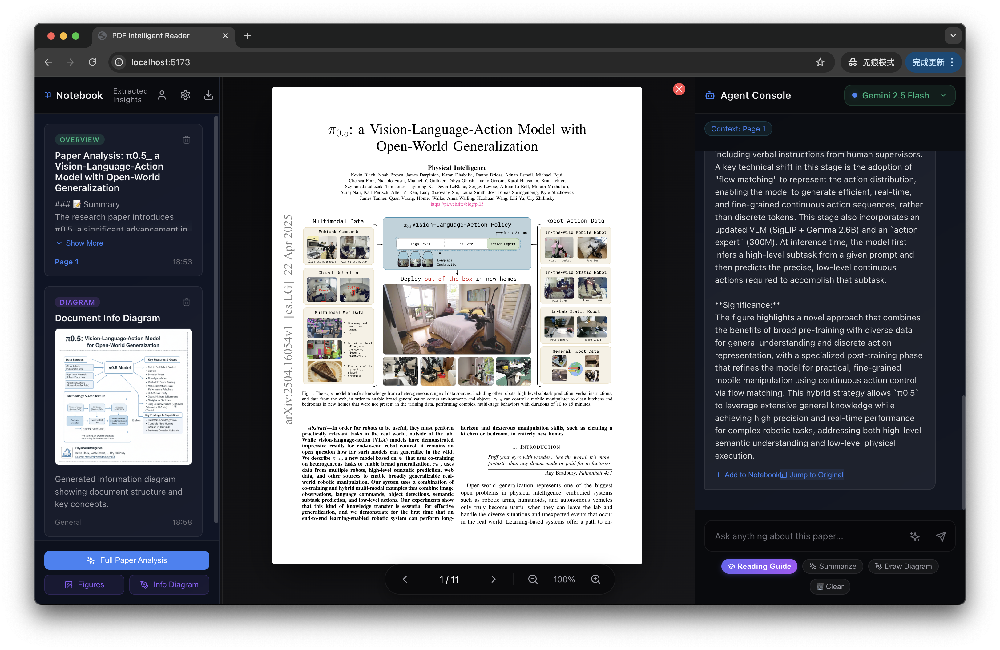
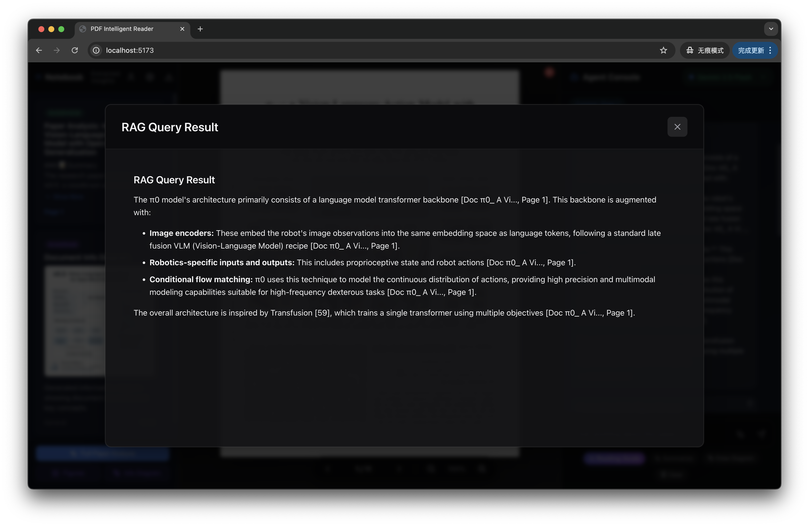
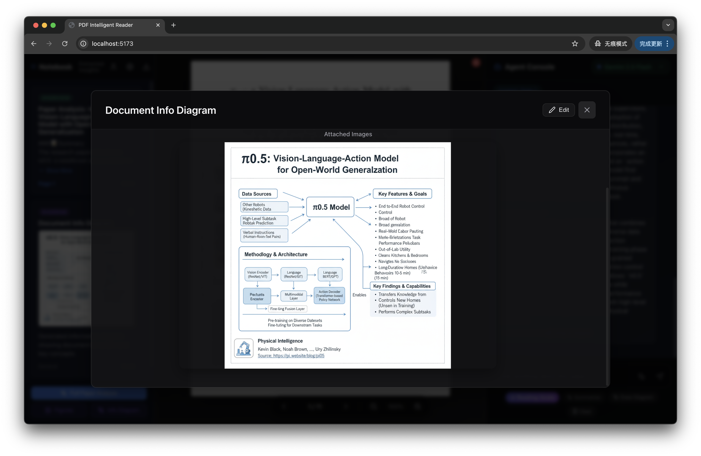
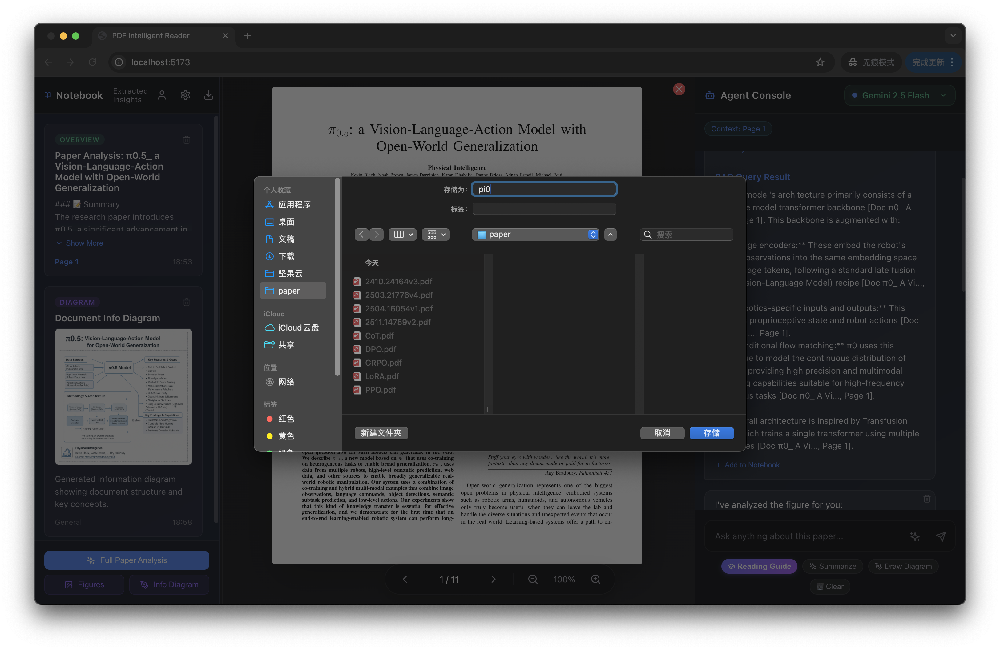
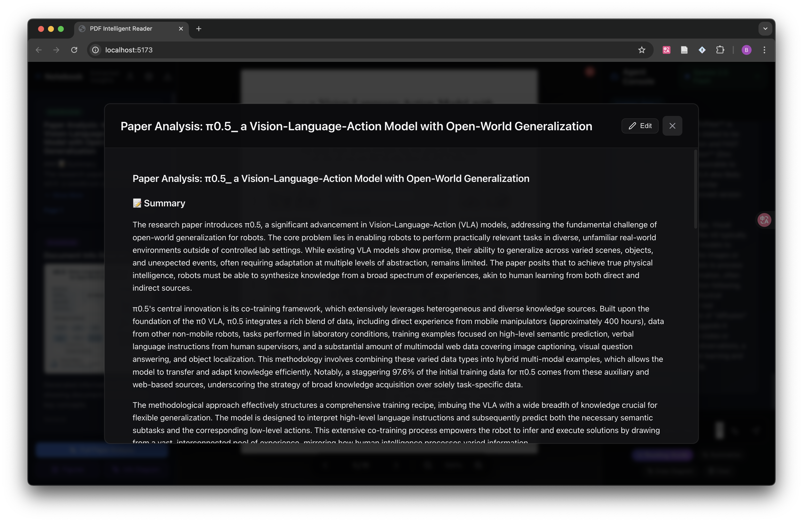
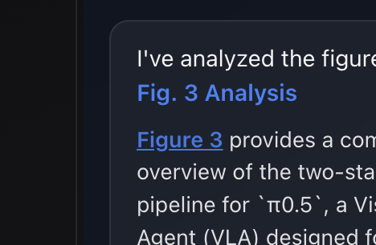
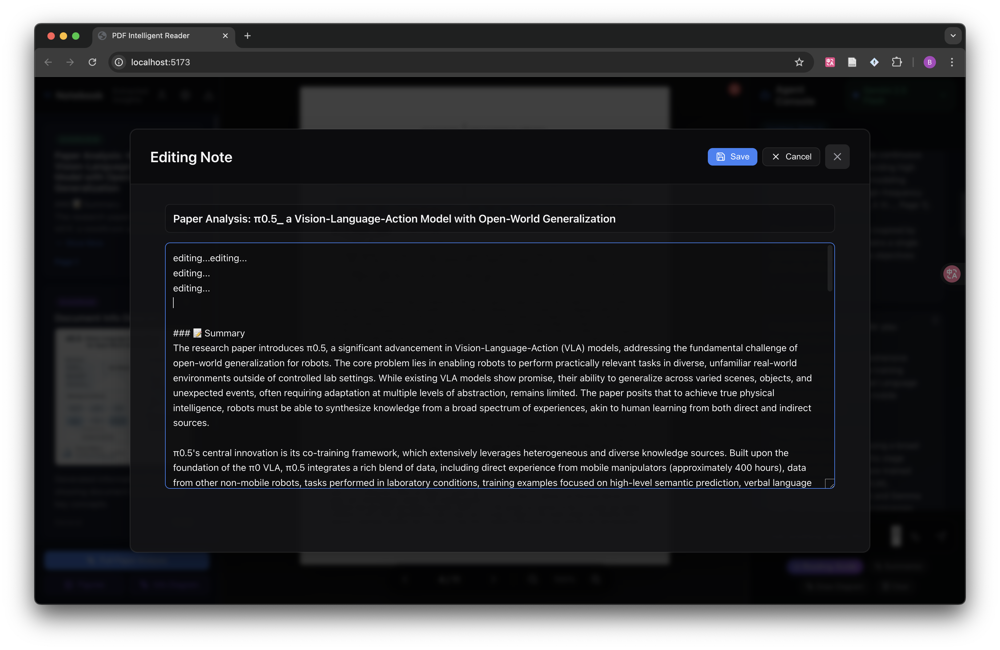
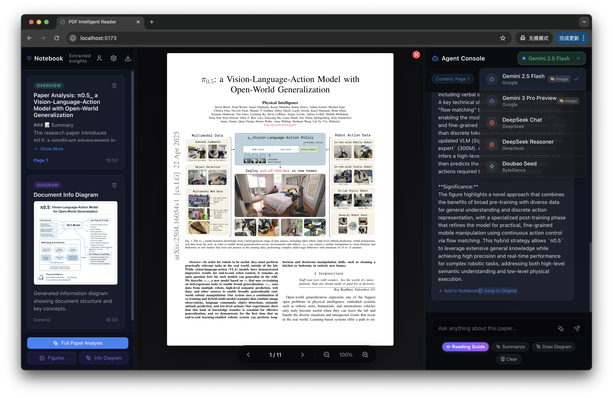
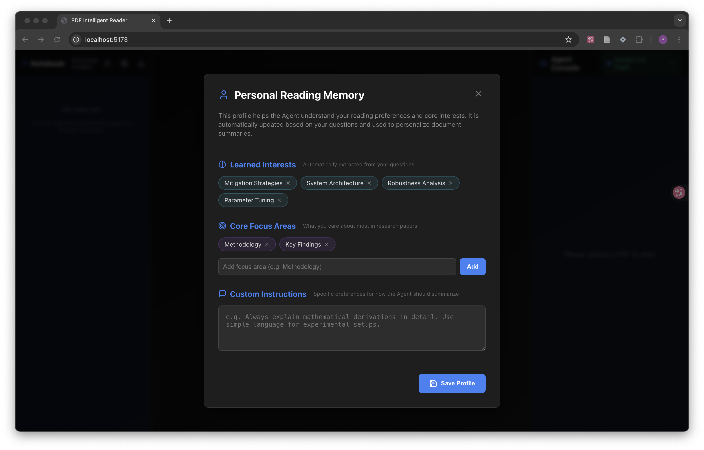
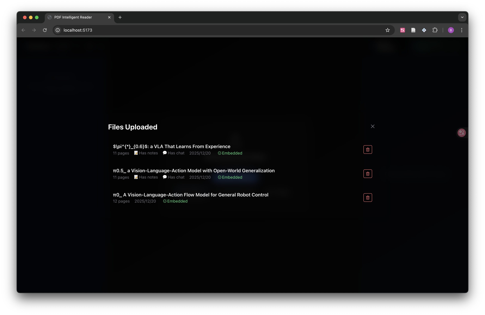

# AI Academic Research Agent

An intelligent, agentic PDF assistant designed to help researchers analyze, understand, and manage academic literature with high efficiency.

<p align="center">
  
</p>

## Table of Contents
- [1. Motivation](#1-motivation)
- [2. Problem Definition](#2-problem-definition)
- [3. Application Design](#3-application-design)
- [4. Agentic Framework](#4-agentic-framework-perception-planningmemoryaction)
    - [4.1 Perception](#41-perception)
    - [4.2 Planning](#42-planning)
    - [4.3 Memory](#43-memory)
    - [4.4 Action](#44-action)
- [5. System Architecture](#5-system-architecture)
- [6. Implementation Details](#6-implementation-details)
- [7. Key Features (with pictures)](#7-key-features)
- [8. More Features (with pictures)](#8-more-features)
- [9. Getting Started](#9-getting-started)
- [10. Demo](#10-demo)

## 1. Motivation

Although current Vision Language Models (VLMs) like Gemini, DeepSeek, and OpenAI have reached incredible levels of reasoning, current PDF reading products still suffer from a fundamental flaw: **fragmented capabilities and broken reading workflows**.

In real research or professional work, reading is never a single step. It is a continuous pipeline: skimming (abstracts, charts), intensive reading (Q&A, deep analysis), synthesizing (diagrams, concept maps), and finally outputting structured thoughts. When these steps are forced across multiple tools, users frequently switch windows, leading to loss of context and interrupted thinking. 

The issue today is not that "models are weak", it's that the **workflow is broken**. This project was born to create an **active reading companion** that integrates the entire process of viewing, questioning, understanding, and producing within a single, unified interface.

## 2. Problem Definition: The Fragmented Landscape

Most mainstream tools are strong at specific steps but fail to provide an end-to-end workspace:
- **ChatGPT**: Best-in-class at understanding and reasoning, but PDF viewing and diagram generation are not integrated into a native reading workspace.
- **Doubao**: Excellent at PDF viewing and Q&A, but lacks built-in diagram generation for turning complex explanations into visualizations.
- **NotebookLM**: Great for dialogue and structured synthesis, but lacks a true in-place PDF viewing experience as a native reading environment.

Academic reading specifically faces these critical bottlenecks:
- **Information overload**: It’s hard to quickly grasp the key points of a paper within dense technical text.  
- **Complex diagrams**: Figures, charts, and tables are often difficult to extract or interpret accurately using standard PDF parsers.  
- **Context fragmentation**: Insights and chat history are easily lost when switching between different documents or research sessions.  
- **Knowledge silos**: It’s difficult to connect information and identify synergies across multiple related papers.

## 3. Application Design

I will implement a new **Integrated PDF Academic Reading Agent**: a three-pane interactive application (left: note panel, middle: PDF reader, right: chat area), supporting the following capabilities within the same environment:

* **Multi-PDF Upload and Knowledge Base Retrieval**: Cross-document Q&A and comparative reading as supplementary capabilities.
* **Automatic Recognition and Explanation of Charts**: Helping users understand articles through charts, explaining modules and processes.
* **PDF Visualization**: Generating infographics for the entire article or the current page.
* **Persistent Memory**: Automatically restoring conversations and notes when the same PDF is re-uploaded.
* **Note Export**: Exporting notes as Markdown files.

## 4. Agentic Framework: How it Works

### 4.1 Perception
The agent watches your actions, like scrolling or clicking, to understand what you are reading and what you need next.

### 4.2 Planning
The agent decides the best way to help you. It picks the right tool for tasks like summarizing a page, explaining a complex chart, or creating a new note.

### 4.3 Memory
- **Short-term**: Remembers your current conversation.
- **Long-term**: Saves your notes and chat history for every paper you upload.
- **Knowledge Base**: Searches through all your documents to answer cross-paper questions.

### 4.4 Action
The agent performs the work: it reads the PDF structure, captures high-quality images of diagrams, and exports your notes to Markdown.

## 5. System Architecture

### Backend (FastAPI + Python)
```
backend/
├── app/
│   ├── main.py              # API entry point
│   ├── models/              # Data structures
│   ├── services/            # Core logic (AI Agent, PDF processing, RAG)
│   └── utils/               # Helper functions
├── data/
│   ├── docs/                # Paper metadata
│   ├── embeddings/          # Search index
│   ├── uploads/             # PDFs and images
│   └── file_map.json        # File tracking
└── requirements.txt
```

### Frontend (React + Vite)
```
frontend/
├── src/
│   ├── components/          # UI parts (PDF Viewer, Chat Panel, Notebook)
│   ├── services/            # API connection
│   ├── App.jsx              # Main layout
│   └── main.jsx             # App entry
└── package.json
```

## 6. Implementation Details

### Smart Search (RAG)
- **Section-Aware**: The system labels each piece of text with its section title (e.g., "Methodology") so the agent finds more accurate answers.
- **High Quality**: Uses OpenAI's latest embedding models to understand the deep meaning of academic text.

### Figure Extraction
- **Caption Finding**: The agent looks for "Figure 1" or "Fig. 2" in the text.
- **Smart Capture**: It automatically takes a high-resolution screenshot of the chart area above the caption, ensuring diagrams are clear.

### Auto-Restore History
- **Unique ID**: Every paper gets a unique ID based on its content.
- **Instant Recall**: When you re-upload a paper, your notes, chat history, and extracted images appear instantly.

### Clickable PDF Links
- **Smart Links**: When the agent mentions a figure or section, it creates a link.
- **Auto-Jump**: Clicking the link (e.g., `[Fig. 1]`) makes the PDF viewer jump directly to that page and highlight the area.

### Bilingual Support
- **Cross-Language**: You can read an English paper and ask questions in your native language.
- **Technical Accuracy**: The agent maintains technical precision even when translating complex concepts.

## 7. Key Features
- **Integrated Workflow**: A single 3-panel workspace keeps the PDF visible while you ask questions and take notes, turning fragmented reading into a seamless experience.
<p align="center">
  
</p>

- **Multi-PDF RAG Knowledge Base**: Build a personal knowledge base that enables cross-document retrieval with precise source attribution.
<p align="center">
  
</p>

- **On-Demand Diagram Generation**: Automatically convert complex explanations into clear technical workflows or concept diagrams.
<p align="center">
  
</p>

- **Structured NoteCards & Export**: Transform agent interactions into ready-to-deliver outputs with Markdown and ZIP export support, eliminating the need to switch tools.
<p align="center">
  
</p>

## 8. More Features
- **Full Paper Analysis**: A consolidated workflow that generates a comprehensive overview of the paper's core contributions.
<p align="center">
  
</p>

- **Interactive References**: Clickable citations and figure references that jump directly to the corresponding PDF location.
<p align="center">
  
</p>

- **Dynamic Note Editing**: Refine and customize AI-generated insights directly within the application.
<p align="center">
  
</p>

- **Multi-Model Switching**: Swap between Gemini 2.0/3.0, DeepSeek, and Doubao without losing context.
<p align="center">
  
</p>

- **Personalized Memory**: Automatically restore your personal interests.
<p align="center">
  
</p>

- **Document Long-term Memory**: Build a persistent knowledge base that grows with your research, allowing the agent to recall and synthesize information across your entire document library.
<p align="center">
  
</p>

## 9. Getting Started

### Prerequisites
- Python 3.12+
- Node.js 18+
- API Keys for Gemini, DeepSeek, or OpenAI.

### Installation
1. **Clone the repo**:
   ```bash
   git clone https://github.com/OuyangRuyi/pdf_reader.git
   cd pdf_reader
   conda create -n pdf python=3.12 -y
   ```
2. **Backend Setup (terminal 1)**:
   ```bash
   cd backend
   conda activate pdf
   pip install -r requirements.txt
   # Configure your keys in api_key.sh or via the UI Settings
   uvicorn app.main:app --reload
   ```
3. **Frontend Setup (terminal 2)**:
   ```bash
   cd frontend
   conda activate pdf
   npm install
   npm run dev
   ```

## 10. Demo

- **Local**: Access the service at `http://localhost:5173` after starting both servers.
- **Live Demo**: [https://paperbench-frontend.onrender.com/](https://paperbench-frontend.onrender.com/)

> **Note**: The live demo is hosted on a **Render Free Tier** instance. Due to hardware limitations (limited CPU, Memory and bandwidth), the initial loading, PDF processing, and AI response times may be slower than local execution. You may occasionally encounter **503 errors** or failed responses due to memory exhaustion on the free tier; these issues are environment-specific and will not occur in a local deployment. For the best performance and stability, local deployment is recommended.
